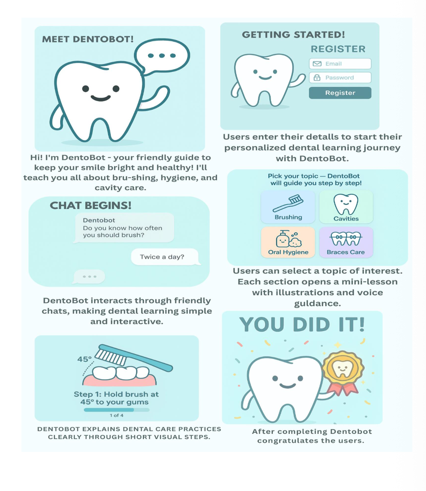

# 🦷 Dentobot – UI/UX Research Project  
UI/UX Research and Design Project for AI-powered Dental Awareness Chatbot (Dentobot)  

## 📌 Overview  
Dentobot is an AI-powered dental awareness chatbot designed to educate users about oral hygiene in an interactive and user-friendly way.  

## 🎯 Objective  
To create a conversational healthcare assistant that:  
- Educates patients  
- Reduces repetitive queries for dentists  
- Improves appointment management  

## 🔍 UX Process  
- User Interviews  
- Surveys  
- Persona Creation  
- Storyboarding  
- Low & High Fidelity Wireframes (Figma AI)  

## 👥 User Personas  
1. Dental Intern  
2. Working Professional Patient  
3. Private Clinic Dentist  

## 🎨 Design Deliverables  
- Low Fidelity Wireframes  
- High Fidelity UI  
- Chat Interface  
- Feedback Module

## 🖼 Storyboard

## 📄 Full Project Report  
See: Dentobot_UI_UX_Project.pdf  
